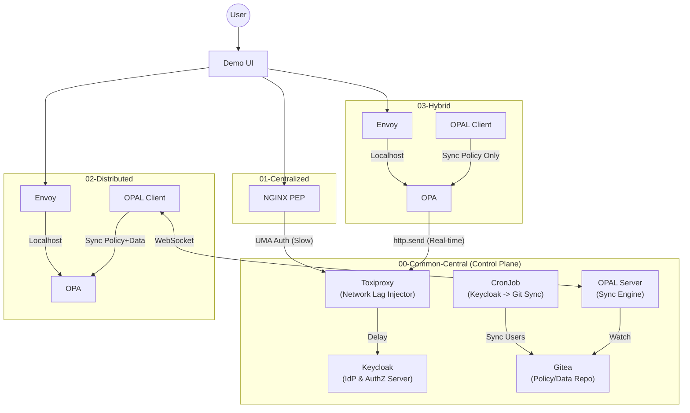

# OSSJ 2025 Authorization Architecture Demo

This repository provides a comprehensive demo environment for comparing three distinct authorization architectures—**Centralized**, **Distributed**, and **Hybrid**—on Kubernetes (Minikube).
It is designed to demonstrate the differences in **latency**, **availability**, **consistency**, and **management** across these patterns.

---

## 🏗 Architecture Overview

All three patterns run simultaneously within the same Kubernetes cluster, enabling direct, side-by-side comparison.

### Patterns

| # | Pattern       | PEP (Policy Enforcement Point) | PDP (Policy Decision Point) | Data Location   | Key Characteristics |
|---|---------------|---------------------------------|-----------------------------|-----------------|---------------------|
| 1 | Centralized   | NGINX                           | Keycloak                    | Central (DB)    | Traditional model. Simple to manage, but higher latency due to network hops for every authorization request. |
| 2 | Distributed   | Envoy                           | OPA (Sidecar)               | Local (Memory)  | GitOps-style model. Policy and data are decoupled and cached at the edge. No external network dependency during authorization (high performance). |
| 3 | Hybrid        | Envoy                           | OPA (Sidecar)               | Remote (API)    | Real-time model. Policy is local, but data is fetched via API at runtime. Balances local logic with real-time data consistency. |

---

## 🧩 Component Diagram



---

## 📂 Directory Structure

Top-level directories and their roles:

| Directory               | Role          | Description |
|-------------------------|---------------|-------------|
| `00-common-central`     | Control Plane | Shared infrastructure components. |
| `01-centralized-tenant` | Tenant 1      | NGINX acts as the Gateway/PEP, performing UMA authorization against Keycloak (via Toxiproxy). |
| `02-distributed-tenant` | Tenant 2      | Envoy + OPA (sidecar). Policy and data are cached locally for autonomous authorization. |
| `03-hybrid-tenant`      | Tenant 3      | Envoy + OPA (sidecar). Policy is local, while data is fetched from the Keycloak API in real time. |
| `10-common-app`         | Demo UI       | Frontend application for switching users (Alice/Bob) and measuring latency. |
| `scripts`               | Tools         | Helper scripts for setup, latency injection, and manual synchronization. |

### `00-common-central` (Control Plane)

Shared infrastructure components used by all tenants:

- `keycloak`  
  - **Role:** IdP / PDP  
  - **Description:** User management and the PDP for the Centralized pattern.

- `gitea`  
  - **Role:** Policy Repo  
  - **Description:** Source of truth for Rego policies and JSON data.

- `opal-server`  
  - **Role:** Pub/Sub  
  - **Description:** Detects changes in Gitea and broadcasts updates to tenants.

- `toxiproxy`  
  - **Role:** Chaos  
  - **Description:** Injects intentional network latency to simulate WAN traffic.

- `keycloak2gitea`  
  - **Role:** DataOps  
  - **Description:** CronJob that syncs Keycloak user roles to Gitea.

### `01-centralized-tenant` (Tenant 1)

Demonstrates the traditional centralized authorization pattern:

- `nginx-pep`  
  - **Role:** PEP (Policy Enforcement Point)  
  - **Description:** Reverse proxy that enforces authorization by querying Keycloak (via Toxiproxy) using the UMA protocol for every request.

- `echo-api`  
  - **Role:** Backend  
  - **Description:** A simple mock API that returns request details.

### `02-distributed-tenant` (Tenant 2)

Demonstrates the fully distributed (GitOps) authorization pattern:

- `echo-api` (Sidecar Deployment)  
  - **Envoy:** Intercepts traffic and queries OPA for authorization decisions.  
  - **OPA:** Evaluates policies locally using cached Rego code and JSON data.  
  - **OPAL Client:** Subscribes to the distributed/ directory in Gitea via OPAL Server to keep policy and data in sync.

### `03-hybrid-tenant` (Tenant 3)

Demonstrates the hybrid (Real-time Fetch) authorization pattern:

- `echo-api` (Sidecar Deployment)  
  - **Envoy:** Intercepts traffic and queries OPA.  
  - **OPA:** Evaluates policies locally but fetches user role data directly from the Keycloak API during evaluation (http.send).  
  - **OPAL Client:** Subscribes to the hybrid/ directory in Gitea to sync only the Rego policy (no data).

### `10-common-app` (Demo UI)

The user interface for interacting with the demo:

- `frontend`  
  - **Role:** Dashboard  
  - **Description:** An NGINX serving a static HTML/JS app. It acts as a BFF (Backend for Frontend) to route requests to the different tenants and handles user login via Keycloak.

### `scripts` (Tools)

Helper scripts for environment management and demo scenarios:

- **init.sh**: One-click script to build the entire environment (namespaces, infra, apps).
- **setup-gitea-*.sh**: Initializes Gitea users and repositories with the initial policy structure.
- **set-latency-*.sh**: Toggles network latency in Toxiproxy on/off to demonstrate performance impact.
- **start-tunnels.sh**: Establishes all necessary kubectl port-forward connections (Frontend, Keycloak, Gitea) to make the demo accessible from localhost.
- **simulate-central-outage.sh**: Simulates a central control plane failure to demonstrate the resilience of the Distributed architecture.

---

## 🚀 Quick Start

### 1. Prerequisites

Make sure the following tools are installed:

- Docker / Minikube  
- `kubectl`, `curl`, `jq`

---

### 2. Setup Environment

Start Minikube and run the setup script.

#### Recommended Minikube Specs

```bash
minikube start --cpus 4 --memory 6144
```

#### Full Setup

```bash
./scripts/init.sh
```

#### Port Forwarding

```bash
./scripts/start-tunnels.sh
```

---

### 3. Access the Demo UI

Open the following URL in your browser:

```text
http://localhost:30000
```

You can:

- Switch between demo users (e.g., Alice / Bob).
- Observe and compare latency and behavior across the **Centralized**, **Distributed**, and **Hybrid** authorization patterns.
